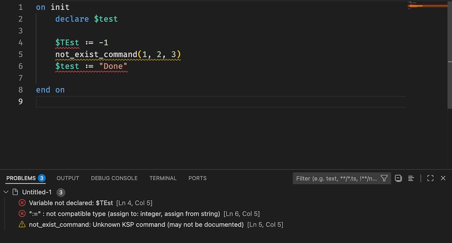
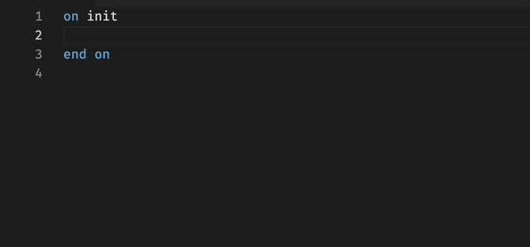
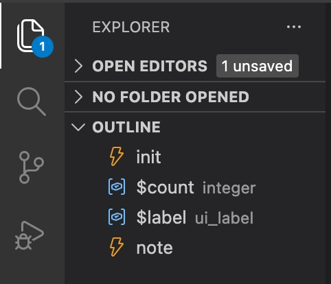
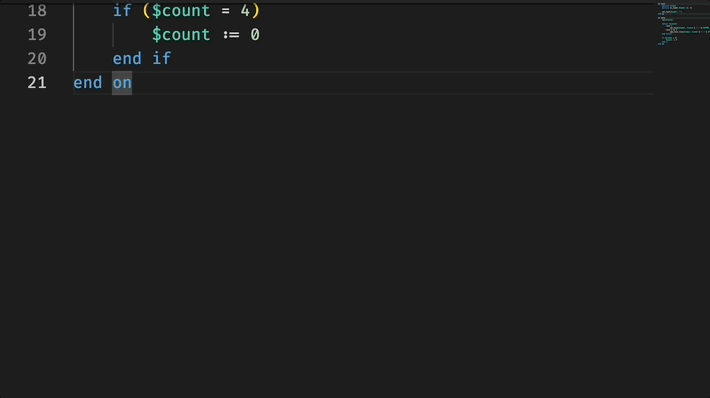
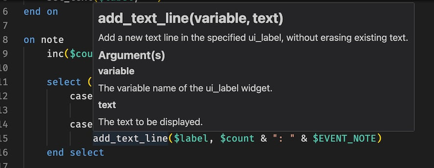
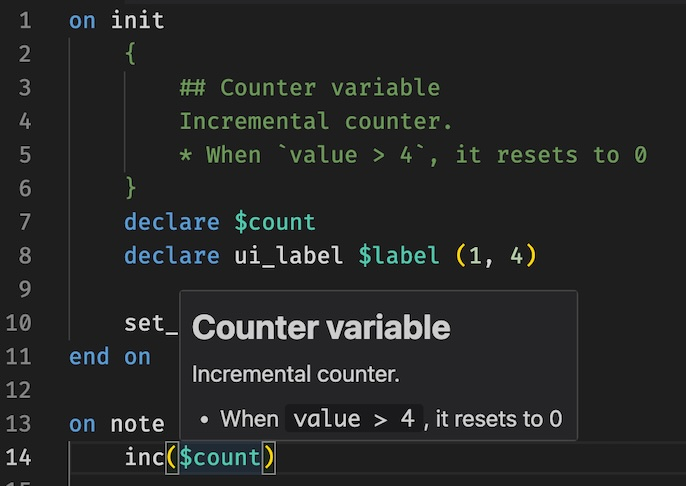

# Language support for NI KONTAKT(TM) Script Processor (KSP) PREVIEW

## KSP Compatibility

- KONTAKT 8.x / 7.x / 6.x / 5.x

## What's New in v1.0.0

- Extension and compiler was redesigned and implemented from scratch (See also [CHANGELOG](CHANGELOG.md))

## Features

- Syntax Analysis / Semantic Analysis
    

- Completion
    

- Document Symbol
    

- Go to Definition
- Find References in script
    
    

- Hover
    - Built-in command / variable information
    - 
    - Comments for user-defined variables and function definitions (Markdown support)
    - 

- Rename
- Signature Help
- Obfuscation

## Obfuscate a Script

1. Open a Script file
2. Set language mode to `ksp`
3. Open command palette and type `ksp`
4. Select `Obfuscate`

## Restart Language Server

1. Open command palette and type `ksp`
2. Select `Restart Language Server`

## Limitations

- Extended syntax is not supported

## Source code

[github repository](https://github.com/r-koubou/vscode-ksp)

### License

[MIT License](https://github.com/r-koubou/vscode-ksp/blob/master/LICENSE)

## Source code of KSP Compler

[github repository](https://github.com/r-koubou/KSPCompiler)

## Author

R-Koubou

* Twitter: [@rkoubou_jp](https://twitter.com/rkoubou_jp)
* GitHub:  [https://github.com/r-koubou/](https://github.com/r-koubou/)

## About KONTAKT

KONTAKT is registered trademarks of Native Instruments GmbH.

[https://www.native-instruments.com/](https://www.native-instruments.com/)
