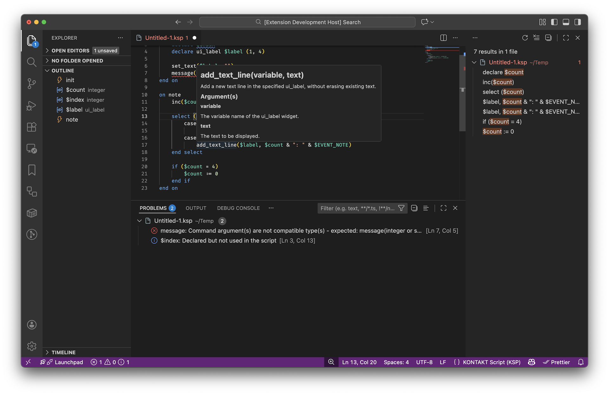

# Language support for NI KONTAKT Script Processor (KSP)

## KSP Compatibility

- KONTAKT 8.x / 7.x / 6.x / 5.x

## What's New in v1.0.0

Since v0.9.0, the extension and the compiler have been completely redesigned and re-implemented from scratch.
See also: [CHANGELOG](CHANGELOG.md)

## Features

Helps you edit KONTAKT Script Processor (KSP) scripts.
This extension includes a language server and provides the following features:

- Syntax and semantic analysis (diagnostics)
- Code completion
- Outline (document symbols)
- Go to Definition
- Find All References
- Hover
  - Built-in command and variable information
  - Markdown documentation from comments on user-defined variables and function definitions
- Rename Symbol
- Signature Help (parameter hints)
- Obfuscation

## Obfuscate a Script

1. Open a script file.
2. Set the language mode to `ksp`.
3. Open the Command Palette and type `ksp`.
4. Select `Obfuscate`.

## Restart the Language Server

1. Open the Command Palette and type `ksp`.
2. Select `Restart Language Server`.

## Limitations

- Extended syntax is not supported.

## Source Code

- Extension: [GitHub repository](https://github.com/r-koubou/vscode-ksp)
- Compiler, Language Server: [GitHub repository](https://github.com/r-koubou/KSPCompiler)

## License

[MIT License](https://github.com/r-koubou/vscode-ksp/blob/master/LICENSE)

## Author

R-Koubou

- Twitter: [@rkoubou_jp](https://twitter.com/rkoubou_jp)
- GitHub: [https://github.com/r-koubou/](https://github.com/r-koubou/)

## About KONTAKT

KONTAKT is a registered trademark of Native Instruments GmbH.

[https://www.native-instruments.com/](https://www.native-instruments.com/)
