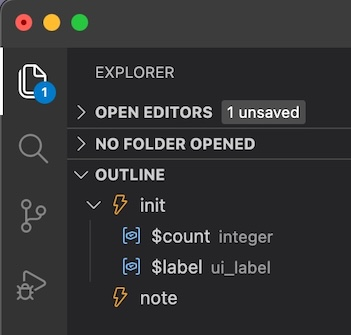

KONTAKT Script Processor (KSP) VS Code Extension
================================================

## What's New in v1.0.2

### Compiler bug fixes

- [#326 Fix Type Propagation Through Binary Expressions](https://github.com/r-koubou/KSPCompiler/pull/326) : Thank you to [cdbeckwith](https://github.com/cdbeckwith)

### Improvements

Variable document symbols are now organized as children of on init.

### KONTAKT 8.8.0 ready

#### Added Variables

- $NI_EPP_EQ_MODE_ELECTRIC_C
- $NI_EPP_TREMOLO_MODE_ELECTRIC_P
- $ENGINE_PAR_EPP_ELECTRIC_C_BRILLIANT
- $ENGINE_PAR_EPP_ELECTRIC_C_SOFT
- $ENGINE_PAR_EPP_ELECTRIC_C_TREBLE
- $ENGINE_PAR_EPP_ELECTRIC_C_MEDIUM
- $EVENT_PAR_OUTPUT_TYPE
- $EVENT_PAR_OUTPUT_INDEX

See the [CHANGELOG](https://marketplace.visualstudio.com/items/rkoubou.ksp/changelog) for earlier versions.
